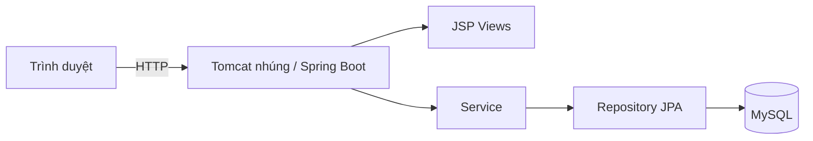

# Smart Parking: Luồng Web — Spring — DB (hiện tại)

Tài liệu phản ánh **trạng thái codebase**: một ứng dụng **Spring Boot** phục vụ HTML/JSP và API nội bộ qua MVC, một nguồn dữ liệu **MySQL**.

---

## 1) Kiến trúc tổng quan

| Lớp | Công nghệ | Vai trò |
|-----|-----------|---------|
| **Presentation** | JSP (`WEB-INF/views/`), **Bootstrap 5**, **Bootstrap Icons**, `static/css/app.css`, JS (`app-ui.js`, `booking-live.js`, …) | Trang landing, đăng nhập/đăng ký, bãi đỗ, đặt chỗ, dashboard, admin tối thiểu |
| **Application** | Spring MVC `@Controller`, Spring Security | Điều phối request, xác thực phiên, validation |
| **Domain** | `service`, `dto`, `domain.entity`, `domain.enums` | Luật nghiệp vụ booking, user, parking |
| **Persistence** | Spring Data JPA (`repository`), Hibernate | Truy vấn MySQL |
| **Database** | MySQL | Bảng: `users`, `parking_area`, `parking_slot`, `booking`, `payment` |

**Không có** Next.js, Prisma hay rewrite `/api/*` sang backend thứ hai: mọi thứ phục vụ qua **cùng một process** Spring (cổng mặc định 8080).

---

## 2) Thành phần quan trọng trong `be/`

### Web (MVC)

- `com.app.web.HomeController` — `/`
- `com.app.web.AuthMvcController` — `/login`, `/register`
- `com.app.web.ParkingMvcController` — `/parking-areas`
- `com.app.web.BookingMvcController` — `/bookings`, `/bookings/new`, hủy booking
- `com.app.web.DashboardMvcController` — `/dashboard`
- `com.app.web.PaymentMvcController` — `/payment/checkout`, `/payment/success`, `/payment/cancel`
- `com.app.web.PaymentWebhookController` — `POST /payment/webhook` (Stripe)
- `com.app.web.ParkingAvailabilityRestController` — `GET /api/parking-areas/{id}/slots` (JSON, theo `startAt`/`endAt`)
- `com.app.web.QueryDemoRestController` — `GET /api/demo/queries/...` (JSON demo: **JOIN** / **EXISTS** / **GROUP BY** cho môn DB; `permitAll`, không thay luồng nghiệp vụ chính)
- `com.app.web.AdminMvcController` — `/admin` → redirect `/admin/home`
- `com.app.web.AdminParkingAreaController` — `/admin/areas` (CRUD bãi, delete = `is_active=false`)
- `com.app.web.AdminParkingSlotController` — `/admin/slots` (CRUD slot, status AVAILABLE/MAINTENANCE/BOOKED)
- `com.app.web.AdminUserController` — `/admin/users` (read-only)
- `src/main/webapp/WEB-INF/views/**/*.jsp`
- `src/main/resources/static/css/app.css`, `static/js` (`app-ui.js`, `booking-live.js`, `validation.js`)

### Bảo mật

- `SecurityConfig` — form login (`email` / `password`), CSRF, logout, phân quyền `/admin/**` = `ROLE_ADMIN`
- `DbUserDetails` / `DbUserDetailsService` — tải user từ DB; **SecurityContext** lưu trong **HttpSession**

### Nghiệp vụ & dữ liệu

- `BookingService` — tạo/hủy booking, overlap slot/user, validation thời gian, payment 1-1
- `StripePaymentService` — Stripe Checkout Session, đồng bộ sau redirect / webhook
- `UserService` — đăng ký (BCrypt)
- `ParkingService` / `ParkingAvailabilityService` — bãi/slot công khai + availability theo khung giờ
- `ParkingAreaService` / `ParkingSlotService` — CRUD admin bãi/slot (tắt `is_active` thay vì xóa vật lý)
- `SlotAvailabilityNotifier` — STOMP broadcast `/topic/slots` khi booking thay đổi
- Entity: `UserEntity`, `ParkingAreaEntity`, `ParkingSlotEntity`, `BookingEntity`, `PaymentEntity`
- Enum tách package: `BookingStatus`, `SlotStatus` (`com.app.domain.enums`)

### Realtime & thanh toán

- `WebSocketConfig` — SockJS endpoint `/ws`, broker `/topic`, payload JSON (ví dụ `SlotTopicMessage`)
- Stripe: cần `STRIPE_SECRET_KEY` (và tùy chọn `STRIPE_WEBHOOK_SECRET`, `APP_PUBLIC_BASE_URL`) — xem `README.md`

### Cấu hình & schema

- `application.yml` — datasource MySQL, JSP prefix/suffix, JPA, `schema.sql` / `data.sql`
- `application-local.yml` (gitignored) — user/password MySQL cục bộ
- Nâng cấp từ DB cũ: đối chiếu `schema.sql` và chỉnh MySQL cho khớp (hoặc tạo lại database — xem `docs/chạy.md`).

---

## 3) Luồng nghiệp vụ chính (đặt chỗ)

1. User đăng nhập → session Spring Security.
2. `/parking-areas` → chọn bãi → `/bookings/new?areaId=...`.
3. POST `/bookings` — `BookingService`:
   - Kiểm tra area/slot tồn tại, slot **active** và `SlotStatus.AVAILABLE`
   - Thời gian hợp lệ, không overlap booking **PENDING/CONFIRMED** (slot & user)
   - Tạo `Booking` + một `Payment` (**CASH** xác nhận ngay; **STRIPE** → booking `PENDING`, redirect Stripe Checkout nếu đã cấu hình key)
4. Với Stripe: sau thanh toán, `/payment/success` hoặc webhook `checkout.session.completed` cập nhật payment **PAID** và booking **CONFIRMED**.
5. `/bookings` — theo dõi; có thể hủy (POST cancel) trong điều kiện cho phép.

**Lưu ý:** `parking_slot.status` trong MySQL phải là **`AVAILABLE` / `BOOKED` / `MAINTENANCE`** (không dùng giá trị legacy như `ACTIVE`) để khớp `SlotStatus` trong Java.

---

## 4) Biến môi trường / profile

- `DATABASE_URL`, `DATABASE_USER`, `DATABASE_PASSWORD` — JDBC MySQL (xem `application.yml`)
- `SPRING_PROFILES_ACTIVE=local` — dùng `application-local.yml`
- `JPA_DDL_AUTO`, `SQL_INIT_MODE` — tùy môi trường (validate + init script mặc định)

---

## 5) Tài liệu liên quan

- `docs/chạy.md` — chạy local MySQL + Spring Boot
- `docs/sql.md` (slide + tham chiếu truy vấn JPQL / native, `BookingRepository`, `QueryDemoRestController`)
- `docs/luong-ket-noi-fe-be-db-chi-tiet.md`
- `docs/erd-smart-parking.md`
- `docs/business-user-journey-tom-tat.md`
- `docs/incident-runbook.md`
- `docs/deployment-guide.md`
- `README.md`
